# yFiles Diagrams in Power BI

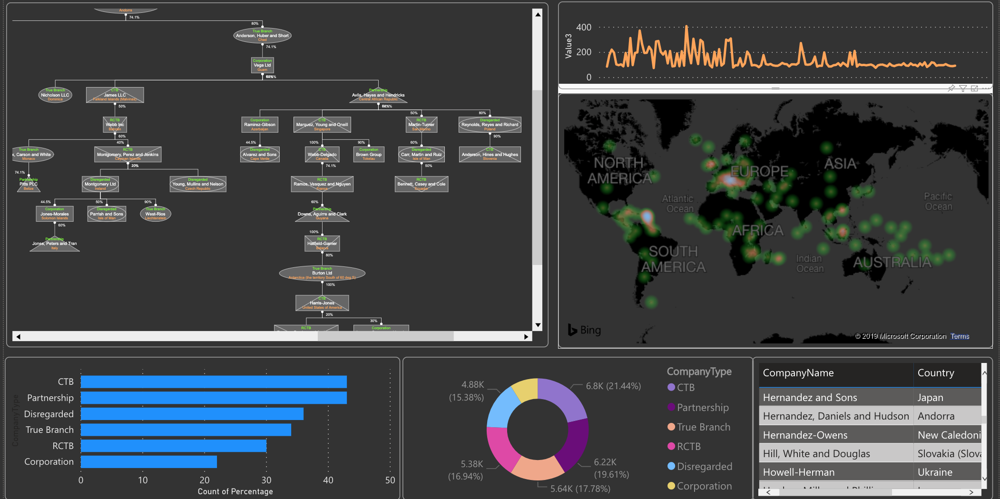 

This sample demonstrates how to get yFiles diagrams into a Power BI dashboard with dataset integration. Many features one expects from such an integration are implemented; filtering, selection synchronization, highlights, styling and more. Below you can find an overview of the features as well as how to compile the code. The [widget's manual](./docs/PowerDiagram.pdf) is also available.

The compiled widget **works both in the desktop version and Power BI online (service)**. The same package can be uploaded an used and you can integrate it in any of your dashboards. The only requirement is a valid yFiles license. You can also download [a trial version](https://my.yworks.com/signup?product=YFILES_HTML_EVAL) and the same license can be used for the Power BI widget.
 
This sample is one of the many ways you can integrate yFiles in your enterprise applications and integrations. Please visit the [demo](https://www.yworks.com/products/yfiles/demos) pages and [our blog](https://www.yworks.com/blog) for the latest bits and graph bonanza. 

## Installation
 
The tutorial [Developing a Power BI visual](https://docs.microsoft.com/en-us/power-bi/developer/custom-visual-develop-tutorial) details the steps to create a custom visual and applies to this yFiles widget as well.
The most import elements in this tutorial are:

- registration of a Power BI certificate for localhost via `pbiviz --install-cert`
- start the custom Power BI development server with 

    `npm run start`

In case the certificate is still giving problems with something like *"net::ERR_CERT_COMMON_NAME_INVALID"*, it's because Chrome browser blocks this address https://localhost:8080 because of non-valid certificate.
Please open the following link in separate browser tab: https://localhost:8080/assets/status. Chrome will show the warning message, click `advanced > proceed` to unsafe version. After that Chrome will work with dev visual correctly.        

You can use any browser to enjoy Power BI dashboards but Chrome is most apt for debugging custom visuals.

If you see an error like the one below

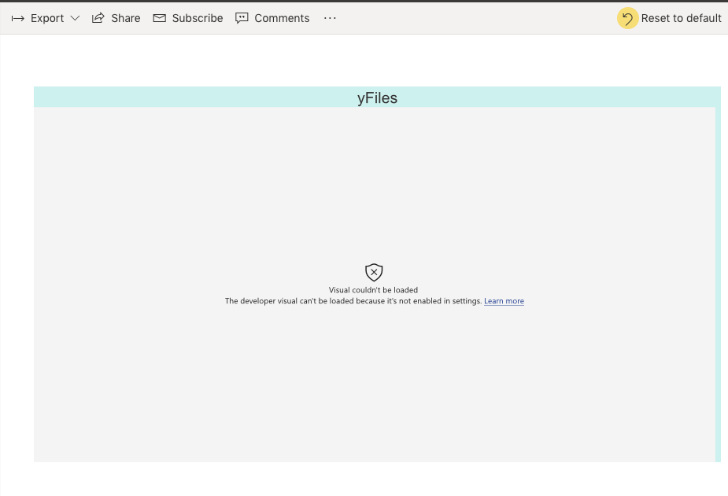

it's because the visual debugging is not set in the settings:

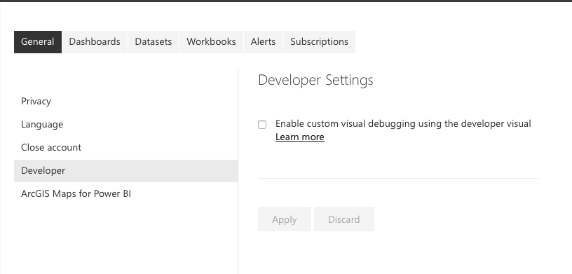 
 
## Sample dashboards

We have assembled two shared dashboards which allow you to see the widget in action. One is based on [a standard tree](https://app.powerbi.com/view?r=eyJrIjoiM2JkMWVmYTUtMDk5OS00NWVmLThjZWMtZGI4NWYyN2E0YmY3IiwidCI6ImVkODVlZmU3LWUwNjgtNDE0Yi1iMjhiLTc4YTA4YjU3YTU4OCIsImMiOjh9) and the other is [a true graph](https://app.powerbi.com/view?r=eyJrIjoiYWE5ZThiOGYtYjQ2OC00NGJkLTgyZGUtNGVhNGUzNThiNTVmIiwidCI6ImVkODVlZmU3LWUwNjgtNDE0Yi1iMjhiLTc4YTA4YjU3YTU4OCIsImMiOjh9):

[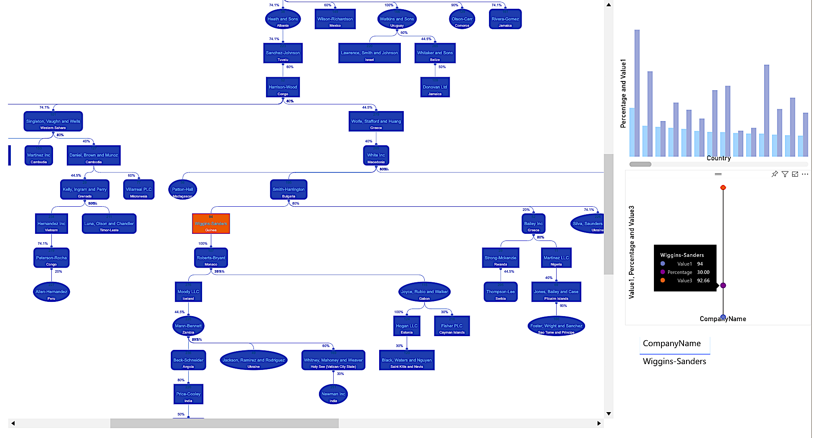](https://app.powerbi.com/view?r=eyJrIjoiM2JkMWVmYTUtMDk5OS00NWVmLThjZWMtZGI4NWYyN2E0YmY3IiwidCI6ImVkODVlZmU3LWUwNjgtNDE0Yi1iMjhiLTc4YTA4YjU3YTU4OCIsImMiOjh9)

[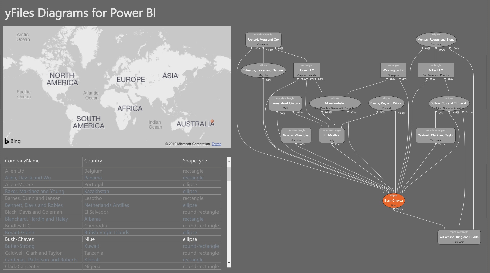](https://app.powerbi.com/view?r=eyJrIjoiYWE5ZThiOGYtYjQ2OC00NGJkLTgyZGUtNGVhNGUzNThiNTVmIiwidCI6ImVkODVlZmU3LWUwNjgtNDE0Yi1iMjhiLTc4YTA4YjU3YTU4OCIsImMiOjh9)

## Data mapping

The yFiles widget consumes a shared dataset. The desktop version of Power BI allows multiple sets but the online only allows one dataset per report. It is via this shared dataset that the widgets within one report can communicate (slicing etc.).
In order to have a graph one needs at least two fields:
- **NodeId**: an id defining the start of an edge. This can be a unique identifier from an entity (say from a database). Internally this id is converted to a string.
- **TargetId**: an id of another entity defining the sink of an edge.

All other fields are optional but you will normally also wish to define:
- the **main label**: the central label shown in the node
- the **shape**: corresponding to the business names given (partnership, ctb, etc.)
- the **edge label**: shown next to the edge, by default at the beginning or source of an edge

In addition, one can also define:

- a **top-label** shown above the main label
- a **sub-label** show underneath the main label.

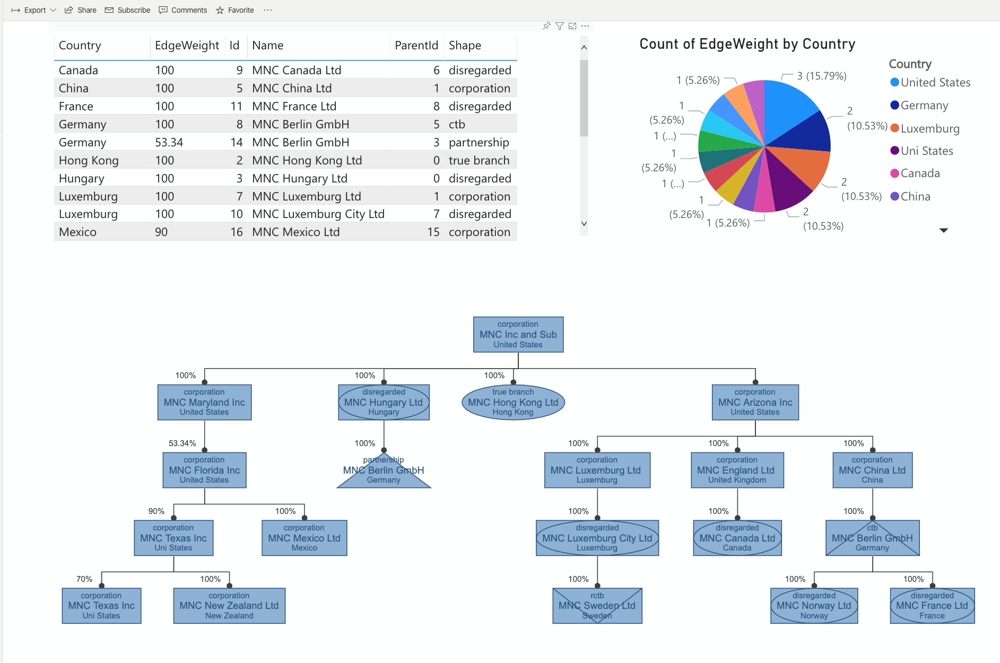

There is a special setting in the 'Nodes' section of the property panel to show in the top-label the percentage deficit (delta) of the outgoing edges. This will override any field set for the top-label. Note that if the outgoing values exceed 100% the shown deficit will be negative.

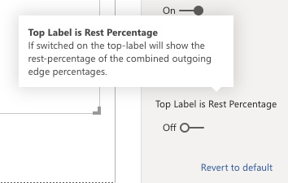

## Styling

There are many style-oriented settings defined and they allow you to tune the look-and-feel of the diagram.
You can alter among other things:

- The node background and border
- The style of the main label as well as the secondary and top label
- The style of the edges and the label of the edge
- The usual style attributes defined by Power BI can be applied
- The layout algorithm applied
- The arrows on the edges.

All of which can also help to brand the whole experience in function of customers and end-users.

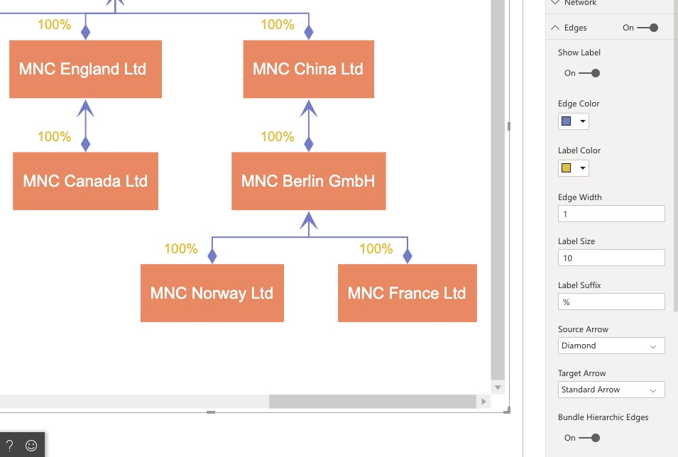

## Filtering

Filtering of the diagram via the Filter panel in Power BI behaves as one would expect. The resulting graph can have disconnected elements but this is automatically handled by the layout.

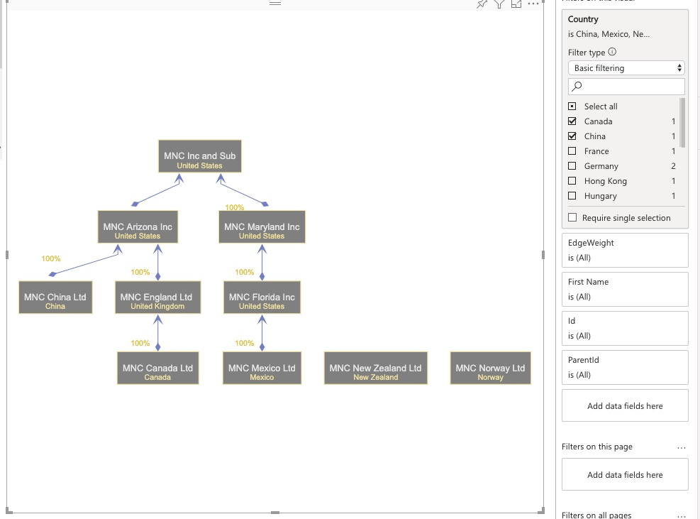

Note in this respect an important setting for the hierarchic layout which merges the edges.

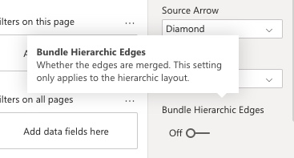

## Neighborhood

Sometimes you want to focus on the vicinity of an item. The neighborhood setting allows you to filter the immediate parents and children of a node. The number corresponds to the depth in the hierarchy. 
This neighborhood shows the whole diagram if no item is filtered or selected since the whole diagram is the neighborhood of itself.

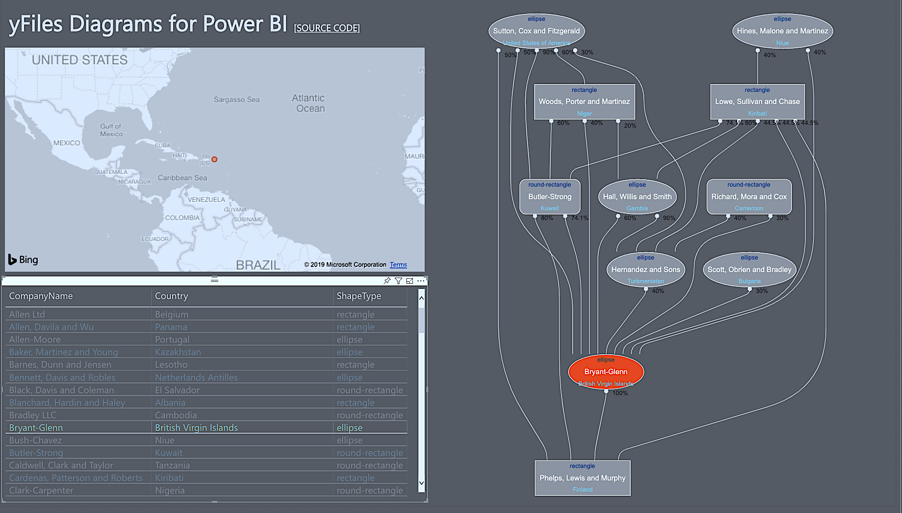

## Slicing and Selection

Nodes in the yFiles widget can be selected and it will trigger the same selection in adjacent report widgets (see screenshot). If the selection corresponds to multiple records in a widget the widget will likely show all the corresponding records. This is true for example for the datagrid but it's really up to the widget to decide how it handles the selection event.

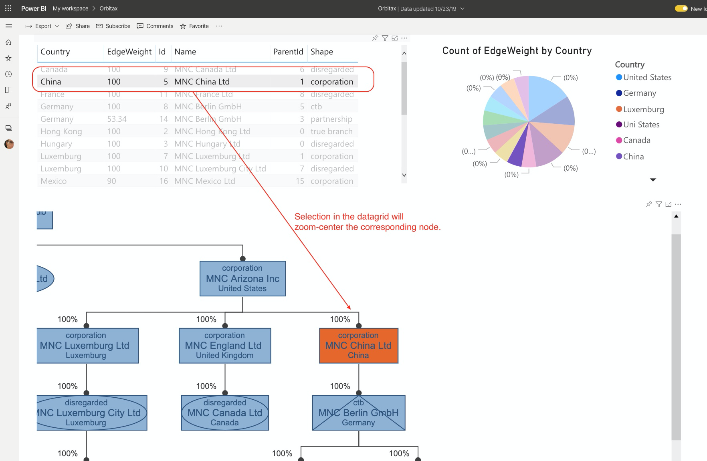

Conversely, if you select an item in an adjacent widget the item will be highlighted and zoom-centered in the yFiles widget. In case there are multiple nodes possible the first one will be taken.
To deselect one should click on the empty canvas of the diagram. This will trigger a redraw of all the widgets. Deselecting all is similar in all widgets.

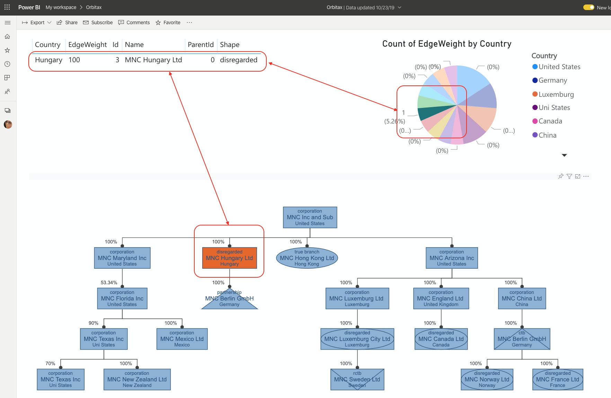      

## Defining Capabilities

The solution has a capabilities.json file which defines the properties of the widget in edit mode. The properties panel has three sub-panels:

- the data fields defining how the widget accesses the necessary values from a dataset
- the widget's properties: look-and-feel as well as behavior
- the analytical properties: not in use

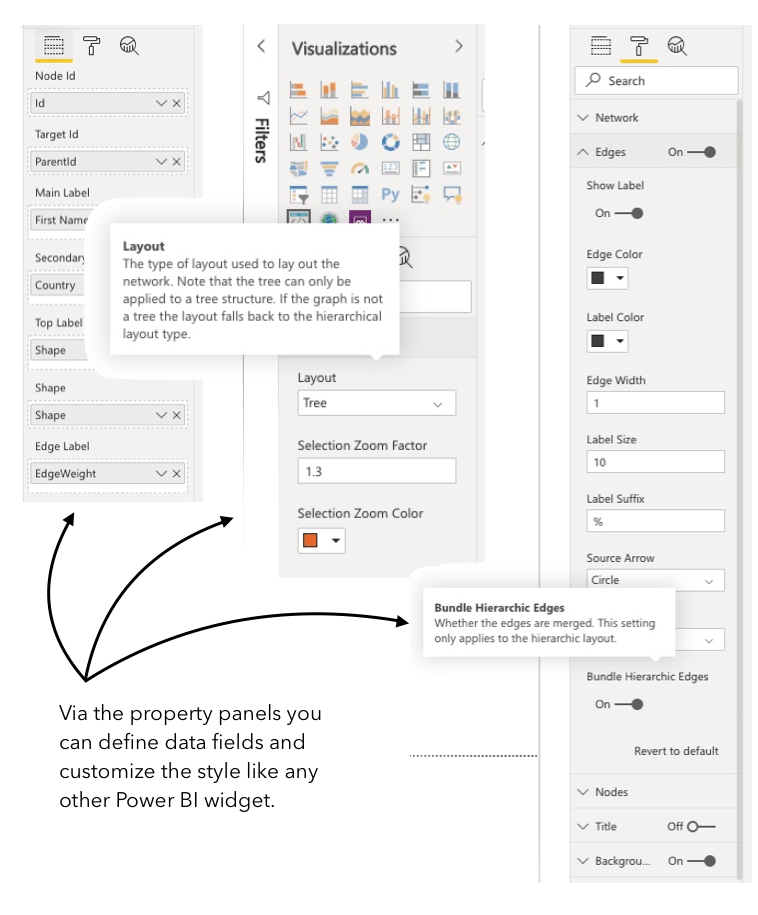

The capabilities format is describe in this page. The names and values have to correspond to the settings.ts file. The json file can be seen as a serialization of the settings file. The settings.ts is crucial for the logic of the visual.
Note that the various elements of the property panels have a description which can be accessed by hovering over it (see adjacent screenshot).

## Custom yFiles Shapes

The shape of the nodes correspond to a field called Shape in the properties panel. The values are mapped to custom shapes in the diagram and if none provided the shapes will default to a rectangle.
The mapping corresponds to the given (business) names. It's easy to alter/extend this list and the custom yFiles visuals are also easy to add. It all amounts to a bit of SVG wrapped in an inherited NodeStyleBase class. The custom shapes can be found in the shapes directory of the solution.

## The pbiviz tool

The tool is crucial for the development of a Power BI widget. It can be installed like any other NodeJS tool:

	npm i -g powerbi-visuals-tools

as a global package. The slightly more challenging part is that you also need to install a localhost certificate to make it work. More info can be found as part of [this tutorial](https://docs.microsoft.com/en-us/power-bi/developer/visuals/environment-setup).
Setting up the certificate is necessary to allow an SSL communication between the localhost serving the custom visual and the online version of Power BI. It's important to emphasize also that
One cannot test and develop a widget with the desktop version.
The certificate is also a necessary requirement to compile the widget to a standalone package, as described below.

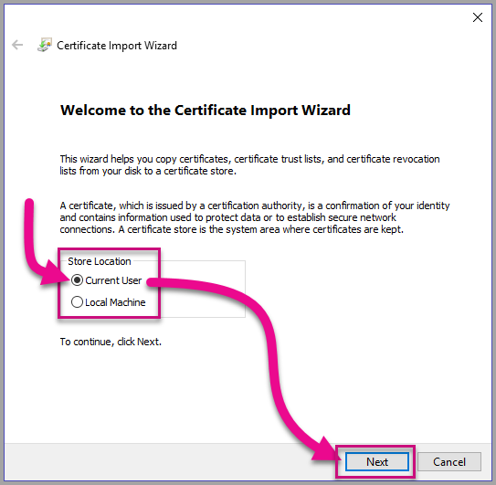

**NOTE:**

You do NOT need to install anything to consume or create a Power BI dashboard. The tool and the certificate are only necessary to alter and existing or create a new custom visual.

## Compilation and Packaging

Using the pbiviz tool one can compile the custom visual to a .pbiviz file which can be imported into the toolbox. The same package works with the online version of Power BI and the desktop version. Simply execute:

	pbiviz package

in the root of the solution and it will output in the dist directory the .pbiviz file.
A typical output looks like the following

    > pbiviz package
    
    info   Building visual...
    info   Start preparing plugin template
    info   Finish preparing plugin template
    info   Start packaging...
    info   Package compression enabled
    info   Package created!
    info   Finish packaging
    Webpack Bundle Analyzer saved report to ~/widget/webpack.statistics.prod.html
    DONE  Compiled successfully in 2532350ms 

NOTE:

Depending on your system, it can take **up to hours** to compile a widget. Should the process fail with an obscure out of memory failure, make sure to provide more memory for your node process, e.g. via environment variables `NODE_OPTIONS=--max-old-space-size=4096`. Unfortunately the tool-chains used are extremely memory hungry.

## yFiles Dependency and License

The widget depends on the lib folder from the yFiles distribution, including the license. 

Of course, once the widget has been compiled as a standalone package (as explained below) the source code (including the license) becomes secondary. The widget is self-contained and works in both the desktop and online version of Power BI.
Obviously, like any other HTML application, you the need the source code to alter the widget and recompile it to a new version. This is in particular true if you wish one day to upgrade the underlying yFiles dependency.

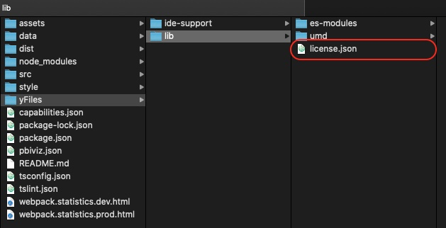

      
## About yFiles

This application is powered by [yFiles for HTML](https://www.yworks.com/products/yfiles-for-html), the powerful 
diagramming library.

Turn your data into clear diagrams with the help of unequaled automatic diagram layout, use rich visualizations for your 
diagram elements, and give your users an intuitive interface for smooth interaction.

You can learn more about the many features that come with [yFiles](https://www.yworks.com/products/yfiles)
on the [yFiles Features Overview](https://www.yworks.com/products/yfiles/features).

If you want to try it for yourself, you can obtain a free evaluation version of yFiles in the 
[yWorks Evaluation Center](https://my.yworks.com/signup?product=YFILES_HTML_EVAL).
 

## Data

In the data folder of the repo you can find a Python notebook which allows you to generate diverse datasets to play with the widget. You can generate both tree-like and graph-like data using various algorithms. The output is a CSV which needs to be uploaded inside Power BI. The procedure is the same for the desktop and the online version. The generated data also shows you the kind of format you need since typically a graph structure needs two datasets (one for the nodes and one for the edges). The required format combines all in one dataset because Power BI does not support multiple data sources per dashboard. It means that there is repetition in the dataset but it's the only way to use a table for graph-like structures. 

Of course, all generated random data is fictitious and any correspondence is accidental.

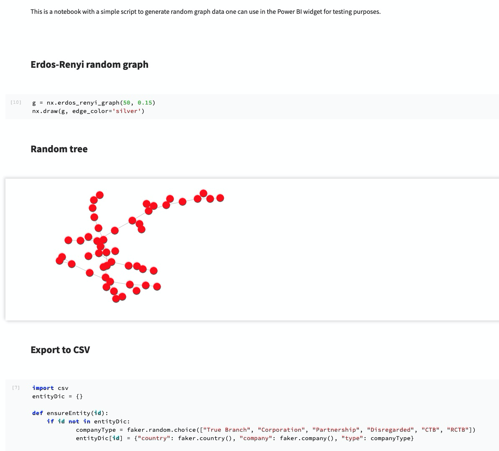

## Feedback

For help or feedback [use Github issues](https://github.com/yWorks/graphs-in-power-bi/issues) or [Tweet us](https://twitter.com/yworks). You can also [mail us directly](mailto:contact@yWorks.com).

## License
The MIT License (MIT)

Copyright (c) 2015-2019 yWorks GmbH

Permission is hereby granted, free of charge, to any person obtaining a copy of this software and associated documentation files (the "Software"), to deal in the Software without restriction, including without limitation the rights to use, copy, modify, merge, publish, distribute, sublicense, and/or sell copies of the Software, and to permit persons to whom the Software is furnished to do so, subject to the following conditions:

The above copyright notice and this permission notice shall be included in all copies or substantial portions of the Software.

THE SOFTWARE IS PROVIDED "AS IS", WITHOUT WARRANTY OF ANY KIND, EXPRESS OR IMPLIED, INCLUDING BUT NOT LIMITED TO THE WARRANTIES OF MERCHANTABILITY, FITNESS FOR A PARTICULAR PURPOSE AND NONINFRINGEMENT. IN NO EVENT SHALL THE AUTHORS OR COPYRIGHT HOLDERS BE LIABLE FOR ANY CLAIM, DAMAGES OR OTHER LIABILITY, WHETHER IN AN ACTION OF CONTRACT, TORT OR OTHERWISE, ARISING FROM, OUT OF OR IN CONNECTION WITH THE SOFTWARE OR THE USE OR OTHER DEALINGS IN THE SOFTWARE.
