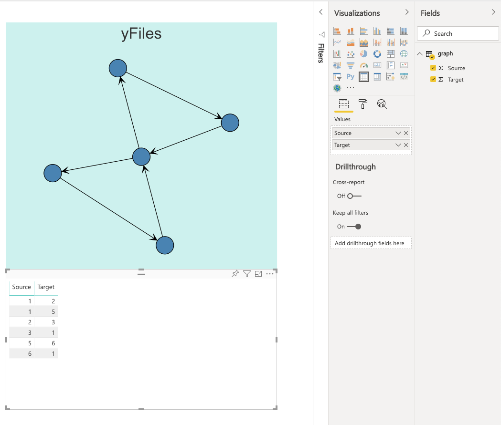

# Graphs in Power BI

This sample demonstrates how to get yFiles diagrams into a Power BI dashboard with dataset integration. 

**Important**: the integration works with a local web server (http://localhost) and and Power BI component is not stand-alone. That is, in order to have a dashboard you can host anywhere one needs to certify a Microsoft Power BI widget. This process is lengthy and outside the scope of this sample. Please consult the [Certified Custom Visuals](https://docs.microsoft.com/en-us/power-bi/power-bi-custom-visuals-certified) document for more information.
 
## Install
 
The tutorial [Developing a Power BI visual](https://docs.microsoft.com/en-us/power-bi/developer/custom-visual-develop-tutorial) details the steps to create a custom visual and applies to yFiles as well.

The most import elements in this tutorial are:

- installing the Power BI tools for NodeJs via `npm i -g powerbi-visuals-tools`
- registration of a Power BI certificate for localhost via `pbiviz --install-cert`
- start the custom Power BI development server with 

    pbiviz start

In case the certificate is still giving problems with something like *"net::ERR_CERT_COMMON_NAME_INVALID"*, it's because Chrome browser blocks this address https://localhost:8080 because of non-valid certificate.
Please open the following link in separate browser tab: https://localhost:8080/assets/status. Chrome will show the warning message, click  advanced > proceed to unsafe version. After that Chrome will work with dev visual correctly.        

In order to display a graph you need a dataset with a column "Source" and a column "Target". Simply drag the columns into the data-binding holders in the properties of the diagram widget.           
 
 

Finally, if you see an error like the one below

it's because the visual debugging is not set in the settings:

 
 
For help or feedback use Github issues or [Tweet us](https://twitter.com/yworks).

      
## About

This application is powered by [yFiles for HTML](https://www.yworks.com/products/yfiles-for-html), the powerful 
diagramming library.

Turn your data into clear diagrams with the help of unequaled automatic diagram layout, use rich visualizations for your 
diagram elements, and give your users an intuitive interface for smooth interaction.

You can learn more about the many features that come with [yFiles](https://www.yworks.com/products/yfiles)
on the [yFiles Features Overview](https://www.yworks.com/products/yfiles/features).

If you want to try it for yourself, you can obtain a free evaluation version of yFiles in the 
[yWorks Evaluation Center](https://my.yworks.com/signup?product=YFILES_HTML_EVAL).
 

## Data

All data is fictitious and any correspondence is accidental.

## License
The MIT License (MIT)

Copyright (c) 2015-2019 yWorks GmbH

Permission is hereby granted, free of charge, to any person obtaining a copy of this software and associated documentation files (the "Software"), to deal in the Software without restriction, including without limitation the rights to use, copy, modify, merge, publish, distribute, sublicense, and/or sell copies of the Software, and to permit persons to whom the Software is furnished to do so, subject to the following conditions:

The above copyright notice and this permission notice shall be included in all copies or substantial portions of the Software.

THE SOFTWARE IS PROVIDED "AS IS", WITHOUT WARRANTY OF ANY KIND, EXPRESS OR IMPLIED, INCLUDING BUT NOT LIMITED TO THE WARRANTIES OF MERCHANTABILITY, FITNESS FOR A PARTICULAR PURPOSE AND NONINFRINGEMENT. IN NO EVENT SHALL THE AUTHORS OR COPYRIGHT HOLDERS BE LIABLE FOR ANY CLAIM, DAMAGES OR OTHER LIABILITY, WHETHER IN AN ACTION OF CONTRACT, TORT OR OTHERWISE, ARISING FROM, OUT OF OR IN CONNECTION WITH THE SOFTWARE OR THE USE OR OTHER DEALINGS IN THE SOFTWARE.
